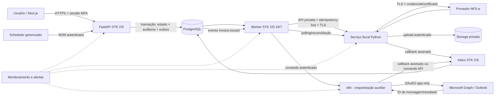

# Arquitetura Online e Segurança — STK OS V1

**Status:** proposta para aprovação; não autoriza implementação nem emissão fiscal

**Data-base:** 19 de agosto de 2026

**Escopo:** arquitetura futura do financeiro/NFS-e, segurança, disponibilidade e continuidade

**Relação com a Etapa 2:** esta análise não altera, amplia nem interrompe a Etapa 2

---

## 0. Resumo executivo

### Parecer

**É tecnicamente recomendável transformar o motor fiscal atual em componente 100% online do STK OS?**

**Sim, condicionalmente à inspeção read-only prevista no Gate B.** O caminho recomendado é a **Alternativa B — extrair o motor fiscal Python**, preservando as regras fiscais já validadas e separando-as da interface desktop e das dependências locais. O resultado deve ser um serviço privado, assíncrono e idempotente, executado em infraestrutura gerenciada 24/7, sem depender do computador pessoal de Thiago.

Essa resposta é uma recomendação arquitetural, não uma conclusão sobre a portabilidade do código atual. O repositório do motor fiscal não está presente no STK OS e nenhum arquivo Python fiscal foi encontrado neste projeto. Portanto, ainda não é possível afirmar se o código depende de Windows, interface gráfica, certificado em token físico, automação de tela, banco local ou bibliotecas incompatíveis com execução em nuvem.

### Recomendação principal

Adotar a seguinte divisão de responsabilidades:

- **STK OS/FastAPI:** fonte oficial de contratos, competências, valores, elegibilidade, identidade do emissor, autorização, estados financeiros, auditoria, idempotência de negócio e reconciliação;
- **worker do STK OS:** processamento durável de outbox/inbox, agendamento, retries, polling, reconciliação e tratamento de estados incertos;
- **serviço fiscal Python privado:** validação fiscal já existente, retenções, montagem da requisição, assinatura quando aplicável, comunicação com NFS-e, interpretação do retorno e obtenção do documento;
- **PostgreSQL:** fonte transacional oficial; nunca o n8n ou o sistema de arquivos do motor fiscal;
- **storage privado:** PDFs/XMLs e outros documentos, com hash, metadados, retenção e backup próprios;
- **n8n:** orquestração auxiliar e conectores, sem decidir invariantes financeiras e sem ser necessário para o motor emitir ou reconciliar;
- **Microsoft Graph/Outlook:** canal de entrega, desacoplado da emissão;
- **IA:** somente interpretação e assistência; nunca valores, impostos, competência, autorização ou decisão de emissão.

### Alternativa de fallback

Se a inspeção demonstrar que o núcleo fiscal é uma biblioteca Python portátil, coesa, sem estado local relevante e sem requisitos de isolamento operacional, usar a **Alternativa C — incorporar o motor fiscal ao monólito modular**, porém executado pelo worker e isolado por módulo/processo, não dentro de uma requisição HTTP síncrona.

Se o legado não puder ser extraído no primeiro incremento, a **Alternativa A — wrapper** pode ser uma ponte temporária em VM/contêiner gerenciado, inclusive Windows se tecnicamente obrigatório. Essa ponte deve ter prazo de retirada, telemetria, API privada, idempotência externa e não pode residir em computador pessoal.

Reescrita (Alternativa D) somente deve ser aprovada quando evidência da inspeção mostrar que preservar o código gera risco fiscal, operacional ou de segurança maior do que revalidar uma implementação nova.

### Princípios não negociáveis

1. Nenhuma operação crítica depende de computador pessoal ligado.
2. O backend, e não o n8n, é dono das regras e estados financeiros.
3. Toda emissão é assíncrona, idempotente, auditável e reconciliável.
4. Timeout depois do envio ao provedor gera estado **incerto**, nunca reemissão cega.
5. Outlook indisponível não impede emissão; NFS-e indisponível não perde a obrigação.
6. Documento fiscal não transita ou permanece no n8n sem necessidade explícita.
7. Segredos, certificado e chave privada nunca entram em Git, logs, auditoria ou payloads de IA.
8. Produção, staging e desenvolvimento têm contas, bancos, buckets, chaves e certificados separados.
9. IA não decide regras fiscais determinísticas.
10. Autonomia exige evidência operacional, kill switch e aprovação explícita do negócio.

---

## 1. Evidências e limites desta análise

### 1.1 O que foi efetivamente inspecionado

Foram inspecionados, sem alteração de código:

- arquitetura e ADRs atuais do STK OS;
- `FastAPI`, autenticação local, autorização por capacidades e service accounts;
- PostgreSQL e migrations existentes;
- tabelas de auditoria, idempotência, inbox, outbox e exceções;
- worker, n8n, staging e produção ainda documentados apenas como fronteiras futuras;
- PRD, Parecer Técnico do Marco 0 e revisão técnica anterior;
- estado atual do monorepo até a Etapa 2.

O repositório atual já implementa fundações úteis: `organization_id`, atores humanos e de serviço, RBAC por capacidades, JWT curto, correlação, idempotência de comandos, inbox deduplicada, outbox transacional, exceções e auditoria append-only. Essas fundações reduzem o risco do desenho futuro, mas ainda não satisfazem os gates de produção.

### 1.2 O que não foi encontrado

Não estão presentes neste repositório:

- código do sistema financeiro Python atual;
- dependências e lockfile desse sistema;
- integração ou schemas de NFS-e;
- exemplos sanitizados de requisição/resposta fiscal;
- documentação sobre certificado digital;
- testes fiscais do legado;
- implantação atual do emissor;
- contratos, faturamento, NFS-e, Outlook ou workflows n8n implementados.

Por isso, qualquer afirmação sobre estrutura interna, portabilidade, Windows, interface, concorrência ou mecanismo de certificado do legado seria especulação. Este documento não faz essas inferências.

### 1.3 Base de segurança adotada

O plano usa como baseline o [OWASP ASVS 5.0.0](https://owasp.org/www-project-application-security-verification-standard/) para requisitos verificáveis de aplicação e o [OWASP API Security Top 10 2023](https://owasp.org/www-project-api-security/) para riscos específicos de APIs. Para Zero Trust, aplica o princípio do [NIST SP 800-207](https://csrc.nist.gov/pubs/sp/800/207/final): nenhuma confiança implícita por localização de rede; cada acesso é autenticado, autorizado e limitado ao recurso necessário.

Meta recomendada para a V1: **ASVS Nível 2**, com requisitos de maior rigor selecionados para autenticação administrativa, certificado, emissão fiscal, documentos e auditoria. A matriz ASVS rastreável deverá ser criada antes de staging e fechada antes de produção.

---

## 2. Arquitetura recomendada para o motor fiscal

### 2.1 Decisão: serviço fiscal extraído, privado e assíncrono

Escolher a Alternativa B como arquitetura-alvo, sujeita ao Gate B. “Extrair” não significa reescrever: significa identificar e preservar a lógica fiscal validada, criar fronteiras explícitas e retirar dependências da interface desktop.

O serviço fiscal deve:

- receber um snapshot fiscal imutável e uma chave de idempotência;
- validar o contrato de entrada e rejeitar campos desconhecidos ou inconsistentes;
- persistir a intenção antes de chamar o provedor;
- executar a regra fiscal existente sem depender de sessão humana;
- retornar rapidamente `202 Accepted` com um identificador interno;
- expor consulta de status idempotente;
- produzir estados explícitos: `received`, `validating`, `submitting`, `issued`, `rejected`, `uncertain`, `cancelled` e `superseded`;
- distinguir erro transitório, rejeição fiscal, erro permanente local e resultado incerto;
- registrar versão do motor, versão de regras/configuração e identificadores externos;
- obter XML/PDF e entregá-los ao storage privado por canal autenticado;
- emitir callback autenticado e aceitar recuperação por polling;
- nunca retornar certificado, chave privada, token ou resposta bruta sensível.

### 2.2 Fronteira de domínio

| Decisão/estado | Dono oficial | Observação |
|---|---|---|
| Contrato e versão vigente | STK OS | História imutável por vigência |
| Competência | STK OS | Mês civil explícito e timezone aprovado |
| Elegibilidade | STK OS | Determinística |
| Valor e moeda | STK OS | Decimal e snapshot |
| Emissor/estabelecimento | STK OS | Autorização e vínculo fiscal |
| Retenções e montagem fiscal | Motor fiscal | Código validado, após inspeção |
| Intenção de emitir | STK OS | `invoice_request` única |
| Chamada ao provedor | Motor fiscal | Com estado persistente próprio ou transacionalmente seguro |
| Nota confirmada | STK OS | Só após evidência do provedor |
| PDF/XML | Storage privado + metadados no STK OS | Hash e vínculo à nota |
| Envio por e-mail | Adaptador Graph/n8n | Não muda verdade fiscal |
| Auditoria oficial | STK OS | Logs externos são auxiliares |
| Reconciliação | STK OS worker + motor fiscal | Com resultado gravado no STK OS |

### 2.3 Contrato conceitual mínimo

O contrato deve ser versionado, por exemplo `/internal/v1/fiscal-requests`, e definido antes da implementação. Estrutura conceitual, não API final:

```json
{
  "idempotency_key": "invoice-request:<uuid>",
  "correlation_id": "<uuid>",
  "organization_id": "<uuid>",
  "invoice_request_id": "<uuid>",
  "issuer": { "fiscal_establishment_id": "<uuid>", "tax_id": "<masked-or-tokenized>" },
  "competence": "YYYY-MM",
  "amount": "0.00",
  "currency": "BRL",
  "service": {},
  "customer": {},
  "withholdings": {},
  "snapshot_sha256": "<sha256>",
  "schema_version": "1"
}
```

Regras do contrato:

- valores monetários como strings decimais no transporte, nunca `float`;
- snapshot canônico e hash calculado pelas duas partes;
- `organization_id` e emissor validados contra a identidade de serviço;
- campos pessoais limitados ao exigido pelo provedor;
- versão do schema obrigatória;
- limites de tamanho e allowlist de tipos;
- resposta sem PDF/XML embutido quando houver storage seguro;
- nenhuma URL arbitrária fornecida pelo cliente para o motor buscar, evitando SSRF;
- nenhuma “correção automática” de dados fiscais pelo motor ou por IA.

### 2.4 Máquina de estados proposta

```text
draft
  └─[autorização determinística]→ ready
       └─[comando idempotente]→ requested
            └─→ processing ────────────────┐
                 ├─→ issued                │
                 ├─→ rejected              │
                 └─→ uncertain ─[reconciliação]
                                      ├─→ issued
                                      ├─→ rejected
                                      └─→ manual_review

issued ─[comando autorizado]→ cancellation_requested → cancelled | uncertain
issued ─[correção autorizada]→ superseded → nova solicitação vinculada
```

`uncertain` é um estado de primeira classe. Nunca deve ser transformado automaticamente em uma nova emissão. O worker primeiro consulta o provedor por identificador, chave, emissor, tomador, valor e janela temporal suportados. Se o provedor não permitir reconciliação inequívoca, abre exceção humana.

### 2.5 Idempotência em camadas

| Camada | Chave/invariante | Resultado de repetição |
|---|---|---|
| Competência | `UNIQUE(contract_id, competence_month)` | Retorna o item existente |
| Execução mensal | `UNIQUE(business_unit_id, competence_month, run_type/version)` | Não duplica lote |
| Solicitação fiscal | `UNIQUE(invoice_request.idempotency_key)` | Retorna a mesma solicitação |
| Snapshot | hash canônico | Mesma chave + hash diferente gera `409` |
| Motor fiscal | chave persistida antes do provedor | Não chama novamente sem reconciliar |
| Provedor | identificador externo/identificador fiscal único | Impede registro duplicado |
| Callback/inbox | `UNIQUE(organization_id, source, external_event_id)` | Reprocessa com segurança |
| Outbox | ID imutável + estado/tentativas | Entrega ao menos uma vez sem duplicar efeito |
| Documento | `UNIQUE(invoice_id, document_kind, provider_version)` + SHA-256 | Não associa arquivo divergente |
| Entrega | `UNIQUE(invoice_id, channel, recipient_snapshot, delivery_version)` | Não envia duas vezes sem comando explícito |

Idempotência não é apenas guardar uma resposta por 24 horas. Para finanças, as chaves de negócio e de emissão precisam de retenção compatível com toda a vida fiscal do registro; cancelamento não libera a chave original.

### 2.6 Disponibilidade alvo

Não há dados de volume ou SLA de negócio aprovados, então este plano não inventa percentuais contratuais. Antes de produção, aprovar:

- **SLO de disponibilidade** do STK OS e do motor fiscal;
- **RPO** por categoria (banco, documentos, auditoria e configurações);
- **RTO** por cenário;
- janela de emissão e prazo legal/operacional;
- fila máxima tolerável e tempo máximo em `uncertain`;
- escala de plantão e responsabilidade por incidentes.

Baseline técnico proposto para discussão: serviços sem estado local em ao menos duas instâncias quando o provedor/plano suportar; banco gerenciado com PITR; objetos replicados/versionados; health checks separados de readiness; autoscaling somente após teste de concorrência; fila durável no PostgreSQL inicialmente, sem introduzir Redis antes de evidência de necessidade.

---

## 3. Diagrama do fluxo online proposto



### Fluxo nominal

1. Scheduler chama um comando idempotente do STK OS ou o worker inicia a competência aprovada.
2. Backend cria `billing_run`, `billing_item`, snapshots, auditoria e outbox na mesma transação.
3. Worker consome a outbox e cria/obtém uma `invoice_request` única.
4. Worker chama o motor fiscal com identidade própria, correlação e chave de idempotência.
5. Motor persiste a intenção antes de chamar NFS-e.
6. Provedor confirma, rejeita ou deixa o resultado incerto.
7. Motor armazena o documento em bucket privado e envia callback; se o callback falhar, o worker consulta por polling.
8. STK OS valida hash, estado, emissor e referência externa e registra a nota em transação auditada.
9. Um novo evento de outbox solicita entrega por Outlook.
10. n8n/Graph entrega e devolve identificador técnico; falha de e-mail mantém a nota emitida e agenda retry.
11. Jobs periódicos reconciliam solicitações, notas, documentos e entregas.

### Regra de desacoplamento

O caminho `STK OS → motor fiscal → NFS-e → STK OS` funciona mesmo com n8n e Outlook indisponíveis. Se a emissão não puder funcionar sem n8n, a arquitetura não atende ao requisito de continuidade.

---

## 4. Comparação das alternativas A/B/C/D

As classificações abaixo são relativas à realidade conhecida. Itens ligados ao legado permanecem condicionais à inspeção.

| Critério | A — Wrapper do atual | B — Extrair motor fiscal | C — Incorporar no FastAPI | D — Reescrita controlada |
|---|---|---|---|---|
| Risco inicial | Médio/alto: herda acoplamentos desconhecidos | **Médio:** mudança de fronteira com regras preservadas | Médio: risco de contaminar monólito/blast radius | Alto: regressão fiscal e comportamental |
| Risco após estabilização | Médio; dívida permanece | **Baixo/médio** | Médio | Médio, somente após revalidação extensa |
| Custo | Baixo/médio | **Médio** | Médio | Alto |
| Tempo | Curto, se implantável em servidor | **Médio** | Médio | Longo |
| Complexidade inicial | Baixa/média | **Média** | Média | Alta |
| Manutenção | Ruim/média | **Boa**, com fronteira coesa | Boa se módulo for realmente puro | Boa após maturação; cara durante transição |
| Escalabilidade | Limitada pelo legado | **Escala independente** | Compartilha escala do backend/worker | Potencialmente alta |
| Disponibilidade | Condicional a estado local/GUI/OS | **Alta**, se stateless e gerenciado | Alta, porém acoplada ao STK OS | Alta por desenho, não comprovada |
| Segurança | Superfície herdada e desconhecida | **Bom isolamento de certificado e egress** | Maior blast radius do backend | Boa por desenho, com risco de falhas novas |
| Observabilidade | Precisa ser adicionada ao redor | **Pode ser incorporada na extração** | Usa stack comum | Precisa ser criada do zero |
| Idempotência | Camada externa pode mitigar, núcleo talvez não | **Pode ser construída na fronteira e no núcleo** | Pode reutilizar fundação STK OS | Precisa ser reimplementada/revalidada |
| Reconciliação | Adaptador adicional | **Responsabilidade explícita** | Responsabilidade do worker/módulo | Nova implementação |
| Dependência de fornecedor | Mantém as atuais | Mantém NFS-e; reduz dependências acidentais | Mantém NFS-e e hosting do monólito | Pode aumentar durante migração |
| Dependência de Windows | Possivelmente alta; desconhecida | **Objetivo de eliminar; a confirmar** | Só viável se eliminada | Pode eliminar, com custo alto |
| Dependência de máquina física | Proibida no alvo; wrapper deve ir para VM/host gerenciado | **Nenhuma no alvo** | Nenhuma | Nenhuma |
| Backup/restore | Difícil se houver estado/arquivos locais | **Bom se estado/documentos externalizados** | Bom com banco/storage comuns | Bom por desenho |
| Testabilidade | Baixa/média | **Boa: golden master + contrato + integração** | Boa, mas testes podem ficar acoplados | Boa, após criar suíte completa |
| Impacto no código validado | **Mínimo** | Baixo/médio, preservando núcleo | Médio | **Máximo** |
| Operação autônoma 24/7 | Condicional | **Melhor equilíbrio** | Possível | Possível apenas após longa validação |
| Isolamento de falha fiscal | Bom se processo separado | **Ótimo** | Menor, salvo processo isolado | Configurável |
| Adequação agora | Ponte temporária | **Arquitetura-alvo recomendada** | Fallback se núcleo for biblioteca portátil | Apenas mediante critérios objetivos |

### 4.1 Alternativa A — Wrapper do sistema atual

Vantagem: menor alteração no comportamento fiscal validado e menor tempo até uma prova online. Risco: levar para a nuvem as mesmas fragilidades de um desktop — GUI, caminhos locais, estado em arquivos, processo único, segredos em disco, ausência de concorrência e dependência de Windows.

Aceitável somente como ponte quando:

- puder rodar em VM/contêiner gerenciado, nunca no computador pessoal;
- a API privada autenticar cada chamada;
- uma camada durável controlar idempotência antes de entrar no legado;
- arquivos e estado forem copiados para armazenamento gerenciado;
- houver watchdog, health check, restart, backup e alertas;
- nenhuma automação de tela for tratada como solução definitiva;
- existir plano e critério de saída para B ou C.

### 4.2 Alternativa B — Extrair o motor fiscal Python

Melhor equilíbrio entre preservar comportamento conhecido e criar operação online segura. Permite ciclo de deploy, escalabilidade, egress, certificado e observabilidade separados sem transformar o sistema em uma arquitetura de microserviços ampla. É justificável porque a emissão fiscal possui isolamento de risco e segredo próprios.

Condições para aprovação:

- testes de caracterização/golden master antes de refatorar;
- saídas comparadas com exemplos anonimizados do sistema atual;
- dependências externas encapsuladas por adaptadores;
- nenhuma regra fiscal movida para n8n;
- estado de emissão durável e reconciliável;
- implantação reproduzível e sem dependência de usuário logado.

### 4.3 Alternativa C — Incorporar ao backend FastAPI

É coerente com o ADR do monólito modular se o motor for uma biblioteca Python pura e portátil. Reduz rede e operação, mas aumenta o blast radius: uma falha de biblioteca, driver, certificado ou provedor pode afetar o backend inteiro.

Se escolhida:

- executar emissão no worker, nunca no processo HTTP;
- manter pacote/módulo fiscal sem dependência de FastAPI;
- isolar timeouts, circuit breaker e pool de recursos;
- restringir acesso ao certificado ao processo worker fiscal, não a toda a API;
- usar filas/outbox e estados idênticos aos da alternativa B;
- permitir futura extração sem reescrever domínio.

### 4.4 Alternativa D — Reescrita controlada

Não é a escolha padrão. Só deve ser autorizada se a inspeção demonstrar um ou mais critérios objetivos:

- regras fiscais inseparáveis de GUI/automação de tela sem testes;
- dependências sem suporte, vulneráveis ou legalmente inviáveis;
- estado não determinístico que impede idempotência/reconciliação;
- impossibilidade de proteger certificado/chave no ambiente alvo;
- incompatibilidade incontornável com execução não interativa 24/7;
- ausência de comportamento recuperável após timeout;
- custo de encapsulamento e teste superior ao de reescrita com paridade comprovada.

Mesmo nesse caso, usar strangler: capturar golden masters, manter o legado como oráculo temporário em homologação, migrar caso a caso e exigir dupla execução comparativa antes de substituir.

---

## 5. Dependências que ainda precisam ser inspecionadas

### 5.1 Pasta/repositório a disponibilizar

Disponibilizar **uma cópia sanitizada e read-only da raiz do repositório que contém a versão exata atualmente usada para emissão**, incluindo histórico Git quando existente. Não basta fornecer apenas um executável ou uma pasta isolada de telas. Se houver mais de um repositório, disponibilizar também bibliotecas internas e scripts de implantação referenciados.

A raiz correta é a que permite localizar:

- entrypoint(s) e inicialização;
- módulos de regra fiscal, retenções e arredondamentos;
- adaptadores de NFS-e e endpoints municipais;
- geração/consulta/cancelamento/substituição;
- persistência local ou banco;
- geração e armazenamento de XML/PDF;
- tratamento de certificado/assinatura;
- configuração e seleção de emissor;
- logs, retries, travas e agendamentos;
- empacotamento/instalação e versão em produção.

### 5.2 Arquivos necessários

Fornecer, quando existirem:

- `pyproject.toml`, `requirements*.txt`, `poetry.lock`, `Pipfile.lock`, `setup.py` ou equivalentes;
- versão de Python e documentação de sistema operacional;
- código-fonte completo e submódulos;
- migrations/schema de banco, sem dump real;
- arquivos de configuração **somente em template sanitizado**;
- Dockerfile, compose, scripts de instalação/serviço e CI;
- manifestos de empacotamento desktop;
- testes unitários, integração, fixtures anonimizadas e snapshots;
- schemas XSD/XML, templates, códigos municipais e mapeamentos;
- exemplos anonimizados de sucesso, rejeição, timeout, cancelamento e substituição;
- documentação operacional, changelog e procedimento de backup/restore;
- lista de endpoints e fornecedores, sem credenciais;
- inventário do certificado: tipo A1/A3 ou serviço remoto, emissor, validade e processo de renovação — sem material secreto;
- evidência de qual commit/tag/build está em produção.

### 5.3 O que **não** deve ser fornecido

Não copiar nem anexar:

- `.env` real;
- arquivos `.pfx`, `.p12`, `.pem`, `.key`, keystore, token A3 ou chave privada;
- senha/PIN do certificado;
- tokens, client secrets, chaves API ou cookies;
- credenciais do banco, NFS-e, prefeitura, Outlook, n8n ou IA;
- dumps produtivos;
- XML/PDF de notas reais sem anonimização formal;
- dados reais de clientes, CPF/CNPJ, e-mails, endereços ou valores identificáveis;
- logs brutos com payloads ou headers de autorização;
- arquivos de licença que contenham identidade/segredo transferível.

### 5.4 Procedimento read-only e sanitizado

1. Identificar e registrar commit/build oficial antes de copiar.
2. Criar clone/cópia recuperável fora da instalação produtiva.
3. Executar secret scanning local antes de disponibilizar; remover segredos do artefato, sem reescrever a origem produtiva.
4. Substituir configurações por `.env.example`/templates sem valores.
5. Gerar fixtures sintéticas com estrutura fiel e identidade fictícia.
6. Bloquear egress de rede no primeiro ciclo de inspeção.
7. Não instalar certificado real e não conectar a banco produtivo.
8. Não executar entrypoint capaz de emitir; começar por análise estática, dependências e testes offline.
9. Usar sandbox/homologação somente em fase posterior e com credenciais exclusivas.
10. Registrar achados, hashes dos artefatos e ações executadas.
11. Não modificar o legado na Etapa 3; produzir relatório, contrato e plano.

### 5.5 Perguntas que a inspeção deve responder

- Qual porcentagem do código fiscal é independente da UI?
- O motor é determinístico para a mesma entrada/configuração?
- Onde persiste intenção e resultado?
- Como reage a duas chamadas concorrentes?
- Como identifica que uma nota já foi emitida?
- O provedor oferece consulta por identificador/chave e ambiente de homologação?
- Timeout pode ocorrer depois de o provedor efetivar a emissão?
- Qual certificado é usado e ele permite operação cloud não interativa?
- Há dependências COM, registry, drivers, Office, browser ou caminhos Windows?
- Há armazenamento local de PDF/XML/SQLite?
- Como múltiplos emissores são segregados?
- Quais respostas são transitórias, permanentes ou incertas?
- Cancelamento/substituição são suportados e auditáveis?
- Existe cobertura de retenções, arredondamento e municípios relevantes?

---

## 6. Arquitetura de segurança — Security Architecture Plan STK OS V1

### 6.1 Modelo de confiança

Cada fronteira abaixo é não confiável por padrão:

- navegador ↔ frontend;
- frontend ↔ backend;
- backend/worker ↔ banco;
- worker ↔ motor fiscal;
- motor ↔ NFS-e;
- STK OS ↔ n8n;
- n8n/worker ↔ Microsoft Graph;
- STK OS/n8n ↔ serviços de IA;
- qualquer serviço ↔ storage;
- callbacks/webhooks ↔ inbox.

Estar na mesma VPC, projeto cloud ou rede Docker não concede autorização. Toda chamada tem identidade, política, escopo, TLS, correlação, timeout e limites. Network policy reduz superfície, mas não substitui autenticação.

### 6.2 Identidade humana e sessões

Arquitetura-alvo:

- provedor OIDC gerenciado; Supabase Auth continua opção preferencial, não decisão consumada;
- MFA obrigatório para todos os usuários em produção e para consoles administrativos; phishing-resistant/passkey quando suportado, TOTP como baseline;
- `aal2`/step-up obrigatório para administrar papéis, integrações, certificado, exportações, cancelamento, substituição, reprocessamento ou liberação de autonomia;
- access tokens curtos, refresh token com rotação e detecção de reutilização conforme suporte do provedor;
- tokens validados por assinatura, algoritmo allowlisted, `iss`, `aud`, `exp`, `nbf`, `iat` e `jti`;
- chave assimétrica/JWKS preferível ao segredo HS256 compartilhado atualmente usado no ambiente local;
- sessão web em cookie `HttpOnly`, `Secure`, `SameSite` apropriado e escopo mínimo; não persistir bearer token em `localStorage`;
- proteção CSRF para comandos quando autenticação usar cookies;
- logout global/revogação, bloqueio imediato de ator no backend e invalidação de sessões de alto risco;
- timeout por inatividade e duração absoluta aprovados por risco;
- recuperação de conta com verificação forte, códigos de recuperação protegidos e alertas; suporte não pode remover MFA sem trilha e dupla verificação;
- mensagens de login e recuperação sem enumeração de usuário;
- rate limit e proteção contra credential stuffing.

Se Supabase Auth for escolhido, MFA precisa ser **aplicado**, não apenas oferecido na UI. A própria documentação recomenda conferir o nível de garantia e impor `aal2` nas APIs/policies: [Supabase MFA](https://supabase.com/docs/guides/auth/auth-mfa).

### 6.3 RBAC, capacidades e escopo organizacional

Manter o modelo atual de papéis + capacidades e acrescentar escopo explícito:

- organização;
- unidade de negócio;
- entidade jurídica;
- estabelecimento fiscal;
- função financeira;
- ambiente;
- classe de ação.

Exemplos de capacidades separadas:

- `billing:read`, `billing:generate`, `billing:approve`;
- `invoice:request`, `invoice:cancel`, `invoice:supersede`, `invoice:reconcile`;
- `documents:read`, `documents:export`;
- `integrations:operate`, `integrations:admin`;
- `audit:read`, `audit:export`;
- `workflow:promote`, `autonomy:enable`, `autonomy:disable`.

Regras:

- autorização sempre no backend por comando e objeto, não apenas por rota/tela;
- verificar `organization_id`, unidade e estabelecimento de cada recurso para evitar BOLA;
- negação por padrão;
- papéis administrativos não implicam automaticamente permissão fiscal;
- ações críticas podem exigir separação de funções/dupla aprovação quando houver segundo usuário habilitado;
- concessões temporárias têm expiração;
- revisão trimestral de acessos e imediata em desligamento/mudança de função;
- usuário bloqueado é recusado mesmo que o JWT ainda não tenha expirado — fundamento que o código atual já aplica.

### 6.4 Identidades máquina-máquina

Cada integração possui identidade exclusiva por ambiente e função:

- `stk-worker`;
- `fiscal-engine`;
- `n8n-billing`;
- `graph-invoice-delivery`;
- `scheduler-billing`;
- agentes/serviços de IA distintos por caso de uso.

Preferência de autenticação, nesta ordem:

1. workload identity/federação do provedor, sem segredo persistente;
2. OAuth 2.0 client credentials com `private_key_jwt` ou certificado;
3. mTLS para serviços internos de alto risco;
4. segredo cliente rotacionável no vault somente quando as opções anteriores não existirem.

Não usar API key compartilhada entre n8n, worker e motor. Tokens devem ter audiência e capacidades estreitas, duração curta e possibilidade de revogação. A autenticação app-only do Microsoft Graph é adequada para serviço de background; pedir somente a menor permissão de aplicação possível e preferir certificado/federação a segredo estático. Referências: [Microsoft Graph app-only](https://learn.microsoft.com/en-us/graph/auth-v2-service) e [conceitos de autenticação/autorização](https://learn.microsoft.com/en-us/graph/auth/auth-concepts).

### 6.5 Banco de dados e Supabase

Modelo preferido: navegador não acessa tabelas financeiras diretamente. FastAPI/worker são os donos dos comandos e usam roles PostgreSQL distintas.

Roles mínimas:

- `stk_runtime`: DML estritamente necessário, sem DDL, sem `BYPASSRLS` salvo decisão documentada;
- `stk_worker`: acesso às filas e comandos necessários, sem administração;
- `stk_readonly`: relatórios controlados;
- `stk_migrator`: DDL somente no pipeline de deploy;
- `stk_backup`: permissão específica de backup;
- `break_glass_admin`: acesso emergencial, MFA, cofre, alerta e auditoria.

Controles:

- TLS obrigatório para conexão;
- banco sem exposição pública desnecessária, com allowlist/network restrictions;
- credenciais separadas por ambiente e aplicação;
- pooler com limites e timeouts;
- schema de negócio não exposto por Data API, ou Data API desabilitada quando não necessária;
- se qualquer schema for exposto, RLS obrigatória e testada para `anon`, `authenticated`, service roles e casos cross-tenant;
- RLS como defesa em profundidade, nunca substituto da autorização de comandos do FastAPI;
- grants explícitos e `PUBLIC` revogado;
- migrations imutáveis, checksum, revisão e execução por CI/CD;
- proibição de migration automática no startup;
- constraints para invariantes financeiras e isolamento;
- auditoria de DDL, grants e acessos administrativos;
- queries parametrizadas; nenhuma expressão n8n gera SQL sobre o núcleo;
- ambientes em projetos/instâncias separados, não apenas schemas.

Em Supabase, tabelas em schema exposto precisam de RLS e grants mínimos; service keys com bypass nunca podem ir ao navegador. Consulte [Row Level Security](https://supabase.com/docs/guides/database/postgres/row-level-security), [network restrictions](https://supabase.com/docs/guides/platform/network-restrictions) e o [checklist de produção](https://supabase.com/docs/guides/deployment/going-into-prod).

### 6.6 Frontend Next.js e API FastAPI

Frontend:

- CSP restritiva com nonce/hash, `frame-ancestors 'none'`, `object-src 'none'`, `base-uri 'self'`;
- HSTS, `X-Content-Type-Options: nosniff`, `Referrer-Policy` e `Permissions-Policy`;
- sem secrets em variáveis `NEXT_PUBLIC_*`;
- sem renderizar HTML de usuário/IA sem sanitização contextual;
- downloads de documentos com autorização server-side e `Content-Disposition` seguro;
- dependências e imagens remotas allowlisted;
- source maps produtivos protegidos;
- nenhuma decisão de autorização confiada ao componente React.

As recomendações de headers e CSP estão documentadas oficialmente pelo [Next.js](https://nextjs.org/docs/app/guides/content-security-policy).

FastAPI:

- HTTPS terminado em proxy confiável com configuração correta de forwarded headers;
- allowlist de hosts e CORS exato por ambiente; nunca `*` com credenciais;
- limites de body, upload, paginação, timeout e concorrência;
- validação estrita de schemas, `extra=forbid` em comandos críticos e respostas tipadas;
- tratamento uniforme de erros sem stack trace ou detalhe de fornecedor;
- autenticação e autorização por dependências compartilhadas;
- rate limit por IP, ator, service account e fluxo sensível;
- proteção SSRF para qualquer integração que aceite destinos;
- OpenAPI/admin/docs desabilitados ou protegidos em produção conforme necessidade;
- versão explícita de API e inventário de endpoints;
- logs com allowlist e redação, nunca payload integral por padrão;
- bibliotecas de criptografia e JWT maduras, algoritmos allowlisted;
- atualizações e scanning contínuos.

### 6.7 Comunicação, callbacks e prevenção de replay

| Ligação | Autenticação | Criptografia/controle |
|---|---|---|
| Navegador → frontend/API | OIDC + sessão MFA | TLS 1.2+; HSTS; CSRF quando cookie |
| Frontend server → FastAPI | token com audiência API ou rede privada + identidade | TLS; allowlist |
| FastAPI/worker → PostgreSQL | role própria/certificado conforme provedor | TLS obrigatório; network restriction |
| Worker → motor fiscal | OAuth M2M/private key ou mTLS | TLS; rede privada; audience restrita |
| Motor → NFS-e | método exigido + certificado | TLS validado; egress allowlist |
| STK OS → n8n | OAuth/API token próprio por ambiente | TLS; endpoint privado/allowlist |
| n8n/worker → Graph | OAuth2 app-only | TLS; permissões mínimas |
| STK OS/n8n → IA | API key/workload identity no vault | TLS; DLP/minimização |
| Serviços → storage | identidade de workload ou URL pré-assinada curta | TLS; bucket privado |

Webhook/callback genérico:

- assinatura HMAC-SHA-256 ou assimétrica sobre método, caminho, timestamp, nonce e hash do corpo;
- timestamp com janela curta aprovada;
- nonce/event ID persistido na inbox com unicidade;
- comparação constante da assinatura;
- segredo/chave por origem e ambiente, com `key_id` para rotação sobreposta;
- body bruto preservado apenas pelo tempo necessário à verificação e redigido depois;
- resposta rápida `202` após validação mínima/persistência; processamento assíncrono;
- IP allowlist como complemento, não autenticação;
- payload divergente com mesmo event ID gera incidente/exceção;
- rate limiting e tamanho máximo.

Para Microsoft Graph, validar `clientState` nas notificações básicas e os tokens de validação quando aplicável; tratar eventos de ciclo de vida e ressincronizar após `missed`. Referências: [autenticidade de change notifications](https://learn.microsoft.com/en-us/graph/change-notifications-with-resource-data) e [lifecycle/missed notifications](https://learn.microsoft.com/en-us/graph/change-notifications-lifecycle-events).

### 6.8 Segurança do n8n

n8n não recebe acesso direto de escrita às tabelas de negócio. Ele chama comandos estreitos e autenticados do FastAPI.

Controles obrigatórios:

- instâncias/projetos separados por ambiente;
- SSO/MFA para administradores e RBAC mínimo;
- credenciais separadas por workflow/função quando viável;
- chave de criptografia da instância protegida e com backup/rotação testada;
- workflows exportados/versionados, revisão e promoção controlada;
- produção protegida contra edição ad hoc;
- Code/Execute Command, acesso a filesystem, community nodes e nós arriscados desabilitados por padrão;
- SSRF protection e allowlist de egress;
- webhook sempre autenticado;
- dados de execução minimizados, redigidos e podados;
- não persistir PDFs/XMLs fiscais como dados de execução;
- backups do banco/configuração e teste de recuperação;
- security audit periódico; o [audit oficial do n8n](https://docs.n8n.io/hosting/securing/security-audit/) detecta webhooks desprotegidos, nós arriscados e configurações ausentes;
- versão suportada, patches e componentes na mesma versão;
- métricas, health checks e alertas;
- queue mode/Redis somente se volume/SLO justificar; a fila oficial do STK OS continua sendo fonte do trabalho pendente.

Logs do n8n nunca substituem `audit_events`, `workflow_runs` e `workflow_actions` do STK OS.

### 6.9 Serviços de IA

Cada caso de IA deve ter finalidade, classificação de dados, provedor/modelo aprovado, prompt versionado, schema de saída, limite de custo, retenção e política de revisão.

Controles:

- minimização e mascaramento antes do envio;
- não enviar certificado, tokens, documentos fiscais integrais, dados bancários ou payloads sem necessidade;
- saída tratada como não confiável e validada por schema/allowlist;
- proteção contra prompt injection em e-mails/documentos;
- ferramentas com capacidades estreitas; leitura por padrão;
- nenhuma credencial inserida no contexto do modelo;
- ações propostas e ações executadas registradas separadamente;
- aprovação humana para ação de maior impacto;
- rate/cost limits e kill switch por caso de uso;
- contrato/DPA, região, retenção, treinamento e subprocessadores avaliados;
- trilha com modelo, versão, prompt, entradas referenciadas por hash, saída estruturada, decisão e revisor.

---

## 7. Estratégia de secrets e certificados

### 7.1 Arquitetura

Usar secret manager gerenciado do provedor escolhido, com KMS/HSM quando aplicável. Exemplos de capacidades exigidas, sem escolher fornecedor neste documento:

- versionamento;
- IAM por workload;
- auditoria de leitura/alteração;
- rotação;
- suporte a material binário/certificado;
- replicação e backup;
- integração sem gravar segredo em imagem, Git ou pipeline log;
- revogação rápida;
- disponibilidade compatível com o serviço.

Hierarquia lógica:

```text
/stk-os/{environment}/{service}/{secret-name}
```

Nunca compartilhar o mesmo valor entre dev, staging e produção.

### 7.2 Política por tipo

| Segredo | Armazenamento/uso | Rotação mínima proposta |
|---|---|---|
| Chaves OIDC/JWT | Provedor de identidade/JWKS; privadas no KMS | Automática e por incidente |
| Credencial PostgreSQL | Workload identity ou secret manager | 90 dias ou dinâmica |
| Service accounts internas | Chave assimétrica/workload identity | 90 dias ou automática |
| Microsoft Graph | Certificado/federação preferível | Antes do vencimento, sobreposição testada |
| n8n | Vault/external secrets; chave da instância protegida | Por capacidade e incidente |
| NFS-e | Vault dedicado ao motor | Conforme provedor e incidente |
| IA | Vault, identidade por aplicação | 90 dias ou suporte do provedor |
| HMAC de webhooks | Vault, chave por origem/ambiente com `kid` | 90 dias, rotação sobreposta |
| URLs pré-assinadas | Geradas sob demanda, nunca armazenadas como segredo durável | Expiração em minutos |

Prazos exatos precisam ser aprovados conforme suporte do provedor. Rotação sem ensaio pode causar indisponibilidade; toda rotação deve aceitar chave atual + próxima durante janela controlada e ter rollback.

### 7.3 Certificado digital fiscal

Não escolher mecanismo antes de saber se é A1, A3, remoto ou específico do município.

Se A1/exportável:

- armazenar pacote criptografado em vault que aceite binário ou storage cifrado com chave KMS separada;
- senha do pacote em segredo separado;
- IAM exclusivo do motor fiscal, sem acesso do FastAPI/n8n;
- montar somente em memória/tmpfs, com permissões restritas, e apagar ao finalizar;
- não incluir em imagem, volume persistente, backup genérico ou crash dump;
- registrar uso do certificado sem registrar conteúdo/chave;
- alertar vencimento com 90/60/30/15/7 dias;
- ensaiar renovação e sobreposição em homologação;
- bloquear seleção de certificado de outro estabelecimento.

Se A3/token físico ou driver Windows:

- avaliar HSM/assinatura remota homologada ou serviço de certificado compatível;
- se hardware for tecnicamente inevitável, usar host/VM corporativo dedicado, redundante e gerenciado, não computador pessoal;
- documentar operador, contingência, renovação, backup suportado e impacto no SLA;
- reconhecer que token físico pode impedir escala horizontal e failover automático.

Chaves privadas não são “backupáveis” por cópia informal. Seguir regras do emissor/AC e manter processo aprovado de recuperação/renovação.

### 7.4 Prevenção e detecção

- `.gitignore` e `.env.example` sem valores, já existentes;
- secret scanning em pre-commit e CI, com bloqueio do merge;
- scanning de histórico e artefatos de build;
- logs de acesso ao vault enviados a destino imutável;
- alerta por leitura anômala, identidade nova ou volume incomum;
- inventário com dono, finalidade, ambientes, criado, rotacionado, expira;
- runbook de revogação por segredo;
- proibição de secrets em tickets, chat, documentação e prompts.

---

## 8. Estratégia de documentos

### 8.1 Modelo

Guardar binários em bucket privado e metadados no PostgreSQL:

- `document_id` imutável;
- organização, entidade, estabelecimento e unidade;
- `invoice_id`/contrato relacionado;
- tipo (`nfse_pdf`, `nfse_xml`, `contract`, etc.);
- classificação de dados;
- bucket/key opacos, sem CPF/CNPJ/nome no caminho;
- MIME detectado pelo servidor, tamanho e SHA-256;
- versão e relação com documento anterior;
- origem, ator/service account e correlation ID;
- retenção, legal hold, criado e excluído logicamente;
- status de malware scan quando aplicável.

### 8.2 Acesso

- buckets nunca públicos;
- download passa por autorização do backend ou URL pré-assinada de poucos minutos, uso/escopo limitado quando suportado;
- URL não entra em auditoria, logs ou e-mail com validade longa;
- checagem de objeto e escopo a cada geração de URL;
- upload por URL pré-assinada restrita a chave, tamanho, tipo e validade, seguido de validação server-side;
- service role de storage nunca no browser;
- `Content-Disposition: attachment` para tipos ativos ou não confiáveis;
- arquivos de usuário passam por allowlist, detecção real de tipo e malware scanning assíncrono;
- PDF/XML fiscal obtido do provedor é tratado como entrada externa não confiável.

Supabase Storage, se escolhido, oferece buckets privados e policies RLS; a documentação reforça que acesso depende de políticas em `storage.objects`: [Storage Access Control](https://supabase.com/docs/guides/storage/security/access-control). URLs assinadas continuam válidas até expirar, portanto a duração deve ser curta: [serving assets](https://supabase.com/docs/guides/storage/serving/downloads).

### 8.3 Integridade, retenção e exclusão

- calcular SHA-256 ao receber e verificar periodicamente/amostralmente;
- comparar hash no download crítico e na restauração;
- habilitar versionamento/object lock quando compatível com política e custo;
- NFs canceladas não são apagadas; estado e vínculo permanecem;
- retenção fiscal e contratual definida por jurídico/contabilidade antes de produção;
- exclusão é workflow autorizado, auditado e compatível com legal hold;
- deleção física ocorre somente após prazo e confirmação de todas as cópias previstas;
- metadados mínimos de auditoria podem ter retenção distinta do conteúdo;
- nenhum documento oficial depende da mailbox Outlook ou da retenção do n8n.

---

## 9. Estratégia de auditoria

### 9.1 Registro oficial

Evoluir `audit_events` append-only atual para registrar:

- `event_id` e timestamp UTC do servidor;
- organização/unidade/estabelecimento;
- ator humano ou service account;
- usuário em nome de quem automação agiu, quando aplicável;
- ação, recurso, ID e resultado;
- antes/depois seguro ou diff allowlisted;
- origem (`web`, `api`, `worker`, `n8n`, `fiscal_engine`, `ai_agent`);
- correlation ID, causation ID e trace ID;
- workflow ID, versão e deployment;
- modelo/agente/prompt version quando IA participou;
- versão do backend e do motor fiscal;
- idempotency key referenciada/hasheada;
- aprovação e política que autorizou a ação;
- referências externas de NFS-e/Graph;
- código de exceção, sem payload sensível;
- hash de documento, não o documento.

### 9.2 Propriedades

- append-only por role e trigger;
- runtime sem `UPDATE/DELETE` na tabela;
- administrador de banco continua sendo uma ameaça: exportar lotes/digests assinados periodicamente para storage imutável/WORM;
- sincronização de relógio e monitoramento de drift;
- retenção definida por categoria;
- acesso de leitura segregado e auditado;
- pesquisa limitada por organização e capacidade;
- antes/depois mascarado para CPF/CNPJ, e-mail, tokens e dados sensíveis;
- auditoria criada na mesma transação da mudança, como a fundação atual já estabelece;
- falha ao registrar auditoria impede comando crítico de confirmar.

### 9.3 Workflow e IA

Criar/planejar:

- `workflow_definitions`;
- `workflow_versions` imutáveis;
- `workflow_deployments` por ambiente/modo;
- `workflow_runs`;
- `workflow_actions`;
- `ai_runs`.

O n8n fornece diagnóstico de execução, mas o STK OS registra a intenção, versão, ação e resultado oficiais. Se o n8n perder logs, a trilha de negócio continua íntegra.

---

## 10. Estratégia de monitoramento e observabilidade

### 10.1 Sinais

Adotar logs estruturados, métricas e traces com OpenTelemetry ou equivalente, mantendo correlação ponta a ponta.

Métricas mínimas:

- disponibilidade/latência/erros de FastAPI e motor fiscal;
- fila: pendentes, idade do item mais antigo, retries e dead letters;
- solicitações por estado e tempo em cada estado;
- volume e idade de `uncertain`;
- divergências de reconciliação;
- duplicidades bloqueadas;
- emissão por estabelecimento/provedor e rejeições por código normalizado;
- documentos esperados versus armazenados e falhas de hash;
- entregas Outlook pendentes/falhas;
- callbacks inválidos/replay/assinatura divergente;
- autenticação falha, rate limit, escalada negada;
- uso e expiração de secrets/certificados;
- banco: conexões, locks, storage, replica/PITR lag;
- backup concluído e restore drill vencido;
- versão/vulnerabilidades críticas de dependências;
- custos/uso de IA e falhas de schema.

### 10.2 Alertas acionáveis

| Severidade | Exemplo | Resposta |
|---|---|---|
| P1 | possível emissão duplicada, chave privada exposta, corrupção/perda, cross-tenant | kill switch, incidente imediato |
| P2 | NFS-e indisponível além da janela, fila fiscal envelhecendo, reconciliação divergente | plantão e contingência |
| P3 | Outlook/n8n indisponível, entregas atrasadas, certificado a 30 dias | operação em horário definido |
| P4 | tendência de latência/custo, atualização disponível | backlog planejado |

Cada alerta precisa de dono, limiar, canal, runbook, deduplicação e critério de encerramento. Não alertar por toda tentativa transitória isolada.

### 10.3 Health checks

- **liveness:** processo responde sem testar todos os fornecedores;
- **readiness:** pode receber trabalho com banco/vault necessários disponíveis;
- **dependency health:** painel separado para NFS-e, Graph, n8n, storage e IA;
- evitar que indisponibilidade do Outlook torne o motor fiscal `unready`;
- synthetic checks em staging/homologação, nunca emissão produtiva real;
- canary sem efeito fiscal para deploy quando possível.

---

## 11. Backup, restore e disaster recovery

### 11.1 Princípio

Backup só existe quando restauração foi testada e reconciliada. Banco, objetos, auditoria, secrets/configurações e workflows têm mecanismos distintos.

### 11.2 Plano por ativo

| Ativo | Backup | Restauração/validação |
|---|---|---|
| PostgreSQL | PITR + backup lógico periódico cifrado fora do projeto | Restore em ambiente isolado; constraints, contagens e hashes |
| Documentos | versionamento/replicação ou cópia incremental em conta/projeto separado | Restaurar amostra e comparar SHA-256/relações |
| Auditoria | incluída no banco + export imutável assinado | Verificar continuidade/digests |
| n8n | banco/configuração/workflows versionados; secrets conforme produto | Subir instância limpa e executar workflow sintético |
| Motor fiscal | imagem/artefato reproduzível, configuração declarativa | Reimplantar versão aprovada sem disco local |
| Secrets/certificados | processo de recuperação suportado pelo vault/AC, não cópia ad hoc | Ensaio de rotação/failover sem expor material |
| Código/migrations | Git + artefatos assinados/SBOM | Rebuild reproduzível e checksum |

Se Supabase continuar, validar plano e retenção: backups diários e PITR variam por plano, e a restauração torna o projeto indisponível durante o processo. A documentação oficial descreve essas condições em [Database Backups](https://supabase.com/docs/guides/platform/backups). O backup do banco não deve ser presumido como backup dos objetos; storage requer política própria.

### 11.3 RPO/RTO

Valores finais dependem de volume, custo e prazo fiscal. Proposta para decisão:

- banco financeiro/auditoria: RPO próximo de zero via PITR; RTO em horas, medido por ensaio;
- documentos fiscais: nenhum documento confirmado sem cópia verificável; RPO próximo de zero após confirmação;
- CRM: RPO/RTO podem ser menos estritos que financeiro, mas no mesmo banco exigem política comum;
- n8n/Outlook: perda de execução não perde intenção; reconstruir a partir da outbox;
- código/configuração: RPO zero após merge/release; RTO por redeploy.

Não aprovar números até teste no plano/provedor escolhido.

### 11.4 Restore drill

Antes de produção e ao menos trimestralmente:

1. restaurar banco em projeto isolado;
2. restaurar conjunto de objetos;
3. aplicar secrets de teste, nunca produtivos;
4. verificar migrations/checksums;
5. reconciliar itens, solicitações, notas, documentos e auditoria;
6. confirmar que não existe job/scheduler ativo capaz de contatar produção;
7. medir RPO/RTO reais;
8. registrar evidência, falhas e ações corretivas.

### 11.5 Disaster recovery

- arquitetura reproduzível em região/projeto alternativo conforme SLO aprovado;
- DNS e certificados de TLS recuperáveis;
- runbook para indisponibilidade regional e corrupção lógica;
- contatos e permissões break-glass testados;
- modo de leitura/pausa de emissão quando verdade estiver incerta;
- reconciliação obrigatória antes de retomar emissão após restore/failover;
- nenhum failover inicia schedulers duplicados: usar lease/leader election e kill switch global.

---

## 12. Disponibilidade e continuidade por cenário

| Cenário | Comportamento esperado | Recuperação |
|---|---|---|
| Computador pessoal desligado | Nenhum impacto; serviços, scheduler, banco e storage estão na nuvem/host gerenciado | Não há ação local necessária |
| Usuário offline | Jobs autorizados continuam; aprovações pendentes aguardam; UI sincroniza depois | Usuário consulta estados/auditoria ao voltar |
| n8n indisponível | Emissão e reconciliação continuam; entregas/integrações auxiliares ficam na outbox | Retry com backoff; reconstruir do STK OS, não de logs n8n |
| Outlook/Graph indisponível | Nota permanece emitida e segura; entrega fica `pending/failed` sem reemitir | Retry, alerta por idade, envio manual autorizado mantendo a mesma entrega |
| Provedor NFS-e indisponível antes do envio | Solicitação permanece pronta/processando; nenhuma nota presumida | Backoff com jitter/circuit breaker e prazo operacional |
| Timeout após envio ao NFS-e | Estado `uncertain`; bloquear nova emissão | Consultar/reconciliar; intervenção humana se ambíguo |
| Callback não retorna | Polling periódico identifica resultado | Inbox deduplica callback tardio |
| Processo executado duas vezes | Uniques + idempotency key devolvem o efeito anterior | Auditoria registra repetição/bloqueio; nenhuma duplicidade |
| Worker cai durante processamento | Lease expira; outro worker retoma | Reconciliar antes de repetir efeito externo |
| Motor fiscal cai | Pedido durável continua no STK OS e/ou journal do motor | Restart/failover; consulta por chave |
| Banco indisponível | Nenhum efeito fiscal novo é autorizado; serviços falham fechados | Restabelecer/DR; reconciliar antes de reabrir |
| Storage indisponível | Se nota foi emitida, estado indica documento pendente; não enviar e-mail sem documento validado | Recuperar do provedor/polling e verificar hash |
| Vault indisponível | Instâncias com lease curto podem terminar trabalho seguro; novas não iniciam ação que exija segredo | Recuperar vault; sem fallback para secret em arquivo |
| Certificado expirado | Emissão bloqueada antes da chamada; itens continuam pendentes | Renovar via processo aprovado e retestar homologação |
| IA indisponível | Nenhum impacto em cálculo/emissão; tarefas assistivas aguardam ou usam fila | Retry/fallback determinístico somente onde definido |
| Restore/failover | Schedulers começam pausados | Reconciliar e adquirir lease único antes de habilitar |

### Padrões de retry

- exponencial com jitter e teto;
- classificação por erro: transitório, permanente, rejeição, incerto;
- limite de tentativas e dead-letter/exceção;
- respeito a `Retry-After` e rate limits;
- circuit breaker por provedor/estabelecimento;
- nenhuma tentativa automática para validação fiscal permanente;
- nenhuma reemissão automática a partir de estado incerto;
- retries carregam a mesma idempotency key e correlation/causation IDs.

---

## 13. Matriz de ameaças principais

Escala qualitativa inicial; deve ser revisada após fornecedor, dados e motor fiscal serem conhecidos.

| Ameaça | Prob. | Impacto | Controles preventivos | Detecção | Recuperação |
|---|---|---|---|---|---|
| Emissão duplicada por retry/concorrência | Média | Crítico | Uniques, idempotência em camadas, lock/lease, estado incerto | Métrica de duplicidade, reconciliação | Kill switch, cancelamento/correção autorizada |
| Emissão com valor/competência incorretos | Média | Crítico | Snapshot, Decimal, regras determinísticas, aprovação/gates | Reconciliação e amostragem | Cancelar/substituir com trilha |
| Uso do emissor/certificado errado | Baixa/média | Crítico | Mapeamento por estabelecimento, IAM por certificado, allowlist | Log de key ID/emissor e alerta | Suspender emissor, revogar/rotacionar, corrigir |
| Exfiltração da chave privada | Baixa/média | Crítico | Vault/KMS/HSM, memória/tmpfs, IAM mínimo | Audit log do vault, secret scanning | Revogação imediata, incidente e reemissão do certificado |
| Escalada de privilégio/BOLA | Média | Alto/crítico | Autorização objeto/capacidade/escopo + RLS | 403 anômalos, testes e SIEM | Revogar sessão/papel, corrigir policy |
| Comprometimento de service account | Média | Alto | Identidade por workload, tokens curtos, audience mínima | Uso fora de padrão/origem | Revogar/rotacionar e replay de fila segura |
| Webhook falsificado/replay | Alta | Alto | HMAC/mTLS, timestamp, nonce, inbox unique | Assinatura falha/replay | Bloquear origem/chave, reprocessar eventos válidos |
| SQL injection/mass assignment | Média | Alto | ORM/queries parametrizadas, schemas estritos, allowlist | SAST/DAST/WAF/logs | Patch, revogar tokens, análise de impacto |
| SSRF via URL/documento/webhook | Média | Alto | Sem URLs arbitrárias, egress allowlist, DNS/IP validation | Egress/anomalias | Bloqueio de rede, rotação de credenciais |
| Documento trocado/corrompido | Média | Alto | Hash, vínculo imutável, storage privado/versionado | Verificação de hash/reconciliação | Restaurar/recuperar do provedor |
| Bucket público/URL longa | Média | Alto | Private by default, policy as code, URL curta | CSPM/security advisor/log de acesso | Fechar policy, invalidar quando possível, incidente |
| Segredo em Git/log/n8n | Média | Crítico | Secret scanning, redaction, vault | Scans e DLP | Revogar, limpar exposição, investigar histórico |
| Comprometimento do n8n/node | Média | Alto | Sem DB direto, nodes bloqueados, egress restrito | n8n audit, comportamento M2M | Isolar n8n, revogar identidade, reconstituir |
| Prompt injection causa ação | Média | Alto | IA sem autoridade fiscal, schema/policy e aprovação | `ai_runs`, ações negadas/anômalas | Desabilitar tool/agente, revisar prompts |
| Dependência/provedor comprometido | Baixa/média | Alto | Pinning/lock, SBOM, SCA, allowlist | CVE/SCA/assinatura de artefato | Patch/rollback/troca de versão |
| Admin altera/apaga auditoria | Baixa | Alto | Role separada, append-only, export WORM assinado | Falha de digest/audit admin | Restaurar, investigar e reconciliar |
| Backup inutilizável/ransomware | Média | Crítico | Cópia isolada, imutabilidade, restore drills | Falha de job/drill | DR a partir de cópia conhecida |
| Dois schedulers após failover | Média | Crítico | Lease/leader election + kill switch | Métrica de líderes/jobs | Pausar, reconciliar, retomar um líder |
| DDoS/abuso de API | Média | Alto | CDN/WAF, rate limits, quotas e limites de body | Saturação/429/anomalias | Scale, bloqueio e degradação controlada |
| Cross-environment contamination | Média | Crítico | Contas/chaves/bancos/certificados separados | Tags/IDs de ambiente e alerta | Parar, revogar e reconciliar |
| Perda de notificações Graph | Média | Médio | lifecycle notifications, delta/full sync | idade da subscription/missed | Renovar subscription e ressincronizar |

---

## 14. Catálogo de controles

### 14.1 Preventivos

- OIDC + MFA/step-up;
- RBAC por capacidades e escopo;
- service accounts separadas e tokens curtos;
- autorização por objeto no FastAPI e RLS/grants como defesa em profundidade;
- constraints/uniques de negócio;
- inbox/outbox e idempotência persistente;
- vault/KMS/HSM e certificados isolados;
- TLS, mTLS/workload identity e egress allowlist;
- buckets privados, URLs temporárias e hashes;
- schemas estritos, queries parametrizadas, CSP e headers;
- ambientes e contas separados;
- CI/CD com revisão, migrations controladas, SAST/SCA/secret scan/IaC scan;
- dependências pinadas, SBOM e artefatos assinados;
- n8n sem DB direto e nós perigosos bloqueados;
- IA sem autoridade sobre invariantes;
- backups isolados e versionamento;
- kill switch por workflow, estabelecimento e global.

### 14.2 Detectivos

- auditoria oficial transacional;
- logs/métricas/traces correlacionados;
- reconciliação periódica STK OS ↔ motor ↔ NFS-e ↔ documentos ↔ Graph;
- alertas de fila, estado incerto, divergência e duplicidade bloqueada;
- SIEM/logs de vault, IAM, banco, storage e deploy;
- n8n security audit;
- secret scanning contínuo;
- SAST, SCA, DAST e testes de autorização;
- monitoramento de vencimento/uso de certificado;
- verificação de hash e continuidade de auditoria;
- Security Advisor/CSPM do provedor;
- revisão de acessos e workflows;
- restore drill e synthetic checks.

### 14.3 De recuperação

- retries classificados e circuit breaker;
- polling/reconciliação para callback perdido;
- dead-letter/exceções com SLA e responsável;
- PITR, cópia lógica externa e restore testado;
- versionamento/replicação de objetos;
- rollback de release/migration compatível;
- revogação e rotação de tokens/secrets/certificados;
- runbooks de indisponibilidade, duplicidade, exposição e corrupção;
- DR com scheduler inicialmente pausado;
- modo assistido/manual e kill switch;
- cancelamento/substituição fiscal autorizados;
- ressincronização Graph após notificações perdidas;
- reconstrução de trabalho do n8n a partir da outbox oficial.

---

## 15. Segurança da cadeia de entrega e infraestrutura

### 15.1 Ambientes

Desenvolvimento, staging e produção devem ter:

- projetos/contas separados;
- bancos e buckets separados;
- domínios e callbacks separados;
- tenants/apps/credenciais separados quando possível;
- certificado de homologação separado do produtivo;
- dados sintéticos fora de produção;
- pipelines de promoção, sem copiar `.env`;
- acessos e logs segregados.

Staging precisa reproduzir arquitetura, autenticação e policies, não necessariamente a mesma escala.

### 15.2 Rede e runtime

- somente frontend/API/webhooks necessários expostos à internet;
- banco, motor, workers, Redis futuro e consoles em rede privada/allowlist;
- firewall/security groups deny-by-default;
- WAF/CDN/rate limiting nas bordas públicas;
- egress allowlist do motor para NFS-e/vault/storage/telemetria necessários;
- contêiner não-root, filesystem read-only e capacidades removidas;
- imagens mínimas, assinadas e escaneadas;
- limites de CPU/memória/processo e timeouts;
- patches do sistema e runtime com SLA de vulnerabilidade;
- sem shell/SSH permanente em produção; acesso just-in-time auditado;
- console administrativo com MFA e break-glass controlado.

### 15.3 CI/CD e segurança contínua

Em cada pull request/release:

- lint, tipos e testes;
- testes de migrations e rollback/compatibilidade;
- testes de autorização e isolamento;
- secret scan;
- SAST Python/TypeScript;
- SCA de Python/npm e licenças;
- SBOM CycloneDX/SPDX ou equivalente;
- scan de imagem e IaC;
- verificação de lockfiles e provenance;
- assinatura do artefato;
- aprovação para produção;
- deploy por identidade do pipeline, nunca credencial pessoal;
- smoke test e rollback;
- DAST/API scan em staging;
- pentest antes de autonomia e após mudança material.

### 15.4 Resposta a incidentes

Runbooks mínimos:

- possível emissão duplicada;
- certificado/chave exposta;
- credencial/service account comprometida;
- cross-tenant/acesso indevido;
- documento vazado/corrompido;
- provedor NFS-e/Graph/n8n indisponível;
- banco corrompido ou backup falho;
- dependência crítica vulnerável;
- IA executando comportamento anômalo;
- falha regional.

Cada runbook inclui detectar, classificar, conter, preservar evidência, comunicar, recuperar, reconciliar, notificar quando legalmente aplicável e fazer post-mortem sem culpa.

---

## 16. Fronteira IA versus software determinístico

| Tema | IA permitida | Determinístico obrigatório |
|---|---|---|
| Contrato | Extrair candidatos de documento, resumir cláusula | Vigência, versão, valor, regra contratual aprovada |
| Faturamento | Explicar exceção e priorizar fila | Competência, elegibilidade, cálculo, arredondamento, snapshot |
| Fiscal | Classificar mensagem/erro não estruturado como sugestão | Imposto, retenção, códigos, emissor, autorização e payload final |
| NFS-e | Resumir rejeição para operador | Emitir, cancelar, substituir, reconciliar e idempotência |
| Documentos | OCR/extração assistida e classificação | Hash, vínculo, autorização, retenção e exclusão |
| Outlook | Redigir mensagem a partir de template/dados aprovados | Destinatários autorizados, anexos, decisão de envio e deduplicação |
| Exceções | Agrupar, resumir, sugerir próxima ação | Estado, permissão, SLA, execução da correção |
| Auditoria | Resumir tendências sobre dados minimizados | Registro oficial, ator, timestamp, antes/depois e correlação |
| Segurança | Detecção assistida de anomalia | Autenticação, autorização, bloqueio e policy enforcement |

Regras absolutas:

- uma saída de IA nunca altera diretamente tabelas financeiras;
- modelo não recebe tool genérica de SQL, emissão, cancelamento ou mudança de papel;
- software valida toda saída por schema, allowlist, política e versão;
- confiança do modelo não substitui regra;
- ausência da IA não pode impedir cálculo, emissão ou reconciliação;
- ações irreversíveis/financeiras exigem comando determinístico e identidade autorizada;
- conteúdo externo é potencial prompt injection;
- prompt/modelo novo é uma versão nova, testada e promovida como workflow.

---

## 17. Riscos residuais e decisões de fallback

| Risco residual | Consequência | Tratamento |
|---|---|---|
| Legado depende de Windows/COM | Extração mais lenta | Wrapper A em VM Windows gerenciada como ponte |
| Certificado A3 físico | Limita cloud/failover | Avaliar assinatura remota/HSM; host corporativo dedicado como contingência |
| Provedor sem idempotência/consulta robusta | Estado incerto perigoso | Journal antes do envio, reconciliação conservadora e revisão humana |
| Município muda integração/schema | Falha de emissão | Adapter versionado, contract tests e canary de homologação |
| Supabase/plano não atende RPO/rede | Risco de continuidade | PostgreSQL gerenciado + object storage + IdP separados |
| n8n Cloud não atende dados/controle | Exposição/operação | Self-hosted gerenciado ou adaptadores diretos no worker |
| Graph app permissions amplas | Blast radius na mailbox | Mailbox dedicada, Application Access Policy/RBAC quando suportado, menor permissão |
| Volume excede fila PostgreSQL | Latência | Medir; introduzir broker/Redis sem mudar contratos/idempotência |
| Equipe operacional pequena | Alertas sem resposta | Serviço gerenciado, runbooks simples, SLO realista e suporte contratado |
| Reescrita vira projeto paralelo longo | Atraso e regressão | Golden master, strangler e critérios de parada |

---

## 18. Requisitos antes de staging

- [ ] Gate A financeiro aprovado com exemplos e invariantes.
- [ ] Gate B concluído com relatório read-only do legado.
- [ ] Alternativa B/C/A temporária formalmente decidida em ADR.
- [ ] Contrato API/estados/idempotência versionado.
- [ ] Sandbox/homologação NFS-e confirmado; produção bloqueada.
- [ ] Provedor de hosting/região/plano escolhido para staging.
- [ ] IdP escolhido; MFA e bloqueio testados.
- [ ] Service accounts individuais e M2M definido.
- [ ] Secret manager implantado; nenhum secret/certificado em Git.
- [ ] Certificado exclusivo de homologação e processo de renovação documentado.
- [ ] Banco/bucket/projeto separados de dev e produção.
- [ ] RLS/grants/roles desenhados e testes negativos cross-tenant.
- [ ] Storage privado, upload/download e hash testados.
- [ ] Inbox/outbox/worker/retry/uncertain modelados.
- [ ] Auditoria cobre humano, serviço, workflow, IA e correlação.
- [ ] n8n decidido e isolado; workflows versionados; sem acesso direto ao banco.
- [ ] Graph tenant/mailbox/permissões de teste confirmados.
- [ ] Logs, métricas, traces e alertas básicos.
- [ ] SAST, SCA, secret scan e dependency pinning no CI.
- [ ] Threat model revisado com achados reais do motor.
- [ ] Dados exclusivamente sintéticos/anonimizados.
- [ ] Kill switch existente por integração e global.
- [ ] Critérios ASVS L2 selecionados e rastreados.

---

## 19. Requisitos antes de produção

- [ ] Gates A, B, C e D concluídos e evidenciados.
- [ ] Nenhuma dependência de computador pessoal ou usuário logado.
- [ ] Infraestrutura reproduzível e ambientes fisicamente/logicamente separados.
- [ ] MFA obrigatório para usuários e consoles; step-up para ações críticas.
- [ ] Tokens/sessões/revogação/recuperação testados.
- [ ] RLS/grants/autorização por objeto revisados independentemente.
- [ ] Banco não exposto indevidamente; TLS/network restrictions ativas.
- [ ] Vault/KMS/certificado com rotação e alertas testados.
- [ ] API/webhooks protegidos contra replay, SSRF, abuso e payload excessivo.
- [ ] CSP/headers/CORS/hosts configurados para produção.
- [ ] Constraints e testes de concorrência/idempotência aprovados.
- [ ] Estado incerto e reconciliação exercitados com falhas injetadas.
- [ ] Documentos privados, hash, retenção e recuperação aprovados.
- [ ] Backup/PITR de banco e backup/versionamento de objetos ativos.
- [ ] Restore completo executado e RPO/RTO medidos.
- [ ] DR/runbook e scheduler pausado no failover testados.
- [ ] Monitoramento, alertas e responsáveis/plantão definidos.
- [ ] n8n hardening/audit, backup e retenção de execução aprovados.
- [ ] Graph mailbox/permissões mínimas e lifecycle/reconciliação testados.
- [ ] Auditoria exportada/imutável e acesso segregado.
- [ ] SBOM, SAST, SCA, DAST, secret/IaC/image scan sem risco crítico aberto.
- [ ] Pentest/revisão de segurança proporcional ao risco concluído.
- [ ] Política LGPD, retenção, operadores/subprocessadores e incidente aprovados.
- [ ] Migração ensaiada e reconciliada.
- [ ] Operação inicialmente manual/assistida, não autônoma.

---

## 20. Requisitos antes de autonomia

- [ ] Gate E concluído.
- [ ] Execução em sombra comparada com o processo atual por janela aprovada.
- [ ] Casos fiscais reais representativos validados sem dados expostos indevidamente.
- [ ] Zero emissão duplicada em testes, staging e período assistido.
- [ ] Concurrency, retry, timeout pós-envio e callback perdido aprovados.
- [ ] Reconciliação completa e periódica sem divergência não explicada.
- [ ] Métricas de sucesso, falha, intervenção e tempo em `uncertain` dentro dos limites aprovados.
- [ ] Todas as exceções têm dono, SLA, runbook e interface operacional.
- [ ] Kill switch global, por estabelecimento e por workflow testado.
- [ ] Falhas de n8n, Outlook, NFS-e, storage, vault e IA simuladas.
- [ ] Restore/DR mais recente aprovado.
- [ ] Certificado com validade e renovação suficientes para a janela autônoma.
- [ ] Versões exatas de backend, motor, workflow e regras congeladas/aprovadas.
- [ ] Mudança de versão rebaixa automaticamente para modo assistido até nova validação quando material.
- [ ] Aprovação explícita do dono de negócio, contabilidade/fiscal e responsável técnico.
- [ ] Critérios automáticos de suspensão definidos (duplicidade suspeita, divergência, certificado, fila, erro sistêmico).

Autonomia é concedida a **uma versão, estabelecimento, competência, conjunto de contratos e política específicos**; não é uma propriedade irrestrita do sistema.

---

## 21. Decisões que precisam de aprovação do negócio

1. SLO, RPO e RTO por financeiro, documentos e CRM.
2. Janela de faturamento e prazo máximo tolerável para emissão/entrega.
3. Regras do Gate A: competência, timezone, pró-rata, arredondamento, centavos, suspensão, retroatividade, cancelamento e substituição.
4. Quem pode solicitar, aprovar, cancelar, substituir, reconciliar e ativar autonomia.
5. Necessidade de dupla aprovação para ações críticas.
6. Entidade/estabelecimento emissor por contrato e política de segregação.
7. Tipo real do certificado, responsável legal, renovação e contingência.
8. Aceitação da Alternativa B como alvo e A/C como fallback condicionado.
9. Critérios objetivos que autorizariam reescrita D.
10. Provedor/região/plano de banco, storage, hosting e IdP; permanência ou não do Supabase.
11. n8n Cloud versus self-hosted versus adaptadores diretos; orçamento e responsável operacional.
12. Tenant, mailbox dedicada e permissões do Microsoft Graph.
13. Retenção de NFs, XML/PDF, contratos, auditoria, logs, e-mails e dados de IA.
14. Dados que podem ser enviados a cada fornecedor de IA e política de revisão.
15. Política de exclusão, legal hold e atendimento LGPD.
16. Quem recebe alertas e quem responde fora do horário.
17. Orçamento para PITR, replicação/versionamento, observabilidade, vault/HSM e suporte.
18. Frequência de restore drill, pentest, revisão de acesso e auditoria.
19. Critérios e duração de sombra, assistido e autônomo.
20. Processo de incidente e autoridade para acionar o kill switch.
21. Contingência operacional quando o município/provedor ficar indisponível além do prazo.

---

## 22. Plano de evolução sem interromper a Etapa 2

Este documento não muda a ordem aprovada. Quando a Etapa 2 terminar e houver autorização:

1. **Etapa 3 — inspeção:** disponibilizar repositório sanitizado; caracterizar comportamento; decidir A/B/C/D; não alterar nem emitir.
2. **Etapa 4 — contratos:** implementar versões e snapshots após decisões de negócio.
3. **Etapa 5 — faturamento:** criar competências, itens, estados e invariantes sem integrar NFS-e real.
4. **Etapa 6 — motor/documentos:** implementar somente a fronteira aprovada, em homologação.
5. **Etapa 7 — Outlook/n8n:** integrar entrega e orquestração auxiliar.
6. **Etapa 8 — operação:** migrar, reconciliar, executar em sombra, assistido e só então autônomo.

Nenhuma atividade desta análise autoriza começar essas etapas agora.

---

## 23. Critérios finais de aceite arquitetural

A arquitetura futura somente pode ser considerada conforme quando for possível demonstrar:

- mesma solicitação repetida/concomitante produz no máximo uma nota;
- timeout em qualquer ponto não causa reemissão sem reconciliação;
- nota confirmada possui documento correto e hash verificável;
- documento e estado sobrevivem à perda do n8n e do Outlook;
- emissão continua sem computador pessoal e sem sessão humana;
- n8n não decide valores, elegibilidade, estados ou permissões;
- motor não pode usar certificado de outro estabelecimento;
- usuário/service account só acessa organização/unidade permitida;
- segredos não aparecem em Git, logs, auditoria, documentos ou IA;
- restore reconstrói banco + documentos + auditoria com RPO/RTO medidos;
- toda ação relevante identifica ator, automação, versão e correlação;
- indisponibilidade externa produz fila/exceção recuperável, não perda silenciosa;
- IA desligada não afeta invariantes ou operação fiscal determinística;
- kill switch suspende novos efeitos sem corromper trabalhos existentes;
- reconciliação explica 100% das solicitações no período aprovado.

---

## 24. Conclusão

**Sim, é tecnicamente recomendável transformar o motor fiscal atual em componente 100% online do STK OS.**

O caminho recomendado é **extrair o núcleo fiscal Python para um serviço privado online (Alternativa B)** porque essa opção preserva ao máximo regras e comportamentos já validados, elimina a dependência de computador pessoal, isola certificado e falhas do provedor, permite operação assíncrona 24/7 e cria uma fronteira clara para idempotência, observabilidade e reconciliação.

A recomendação é **condicional**: primeiro é obrigatório inspecionar o repositório real, de forma read-only e sanitizada, sem certificado, credenciais, dados reais ou emissão. Se a inspeção mostrar que o motor já é uma biblioteca portátil e coesa, a Alternativa C pode ser mais simples, desde que rode no worker e mantenha isolamento de segredos/falhas. Se houver dependências desktop difíceis de remover, a Alternativa A pode servir temporariamente em infraestrutura gerenciada. A Alternativa D só se justifica com evidência objetiva de que reaproveitar é mais arriscado do que revalidar uma reescrita.

Em todos os caminhos, o STK OS continua sendo a fonte oficial de contratos, competências, autorização, estados, auditoria e reconciliação; o motor fiscal executa a especialidade fiscal; n8n e Outlook são componentes auxiliares desacoplados. Essa separação é o que torna a operação online, segura, rastreável e recuperável.

---

## Referências oficiais consultadas

- [OWASP Application Security Verification Standard 5.0.0](https://owasp.org/www-project-application-security-verification-standard/)
- [OWASP API Security Top 10 2023](https://owasp.org/www-project-api-security/)
- [NIST SP 800-207 — Zero Trust Architecture](https://csrc.nist.gov/pubs/sp/800/207/final)
- [Next.js — Content Security Policy](https://nextjs.org/docs/app/guides/content-security-policy)
- [Supabase — Row Level Security](https://supabase.com/docs/guides/database/postgres/row-level-security)
- [Supabase — Multi-Factor Authentication](https://supabase.com/docs/guides/auth/auth-mfa)
- [Supabase — Storage Access Control](https://supabase.com/docs/guides/storage/security/access-control)
- [Supabase — Database Backups/PITR](https://supabase.com/docs/guides/platform/backups)
- [Supabase — Network Restrictions](https://supabase.com/docs/guides/platform/network-restrictions)
- [Supabase — Production Checklist](https://supabase.com/docs/guides/deployment/going-into-prod)
- [n8n — Security Audit](https://docs.n8n.io/hosting/securing/security-audit/)
- [Microsoft Graph — App-only authentication](https://learn.microsoft.com/en-us/graph/auth-v2-service)
- [Microsoft Graph — Authentication and authorization basics](https://learn.microsoft.com/en-us/graph/auth/auth-concepts)
- [Microsoft Graph — Change notification authenticity](https://learn.microsoft.com/en-us/graph/change-notifications-with-resource-data)
- [Microsoft Graph — Lifecycle and missed notifications](https://learn.microsoft.com/en-us/graph/change-notifications-lifecycle-events)

Referências verificadas em 19 de agosto de 2026. Na implementação, versões, planos e capacidades dos provedores deverão ser confirmados novamente.
